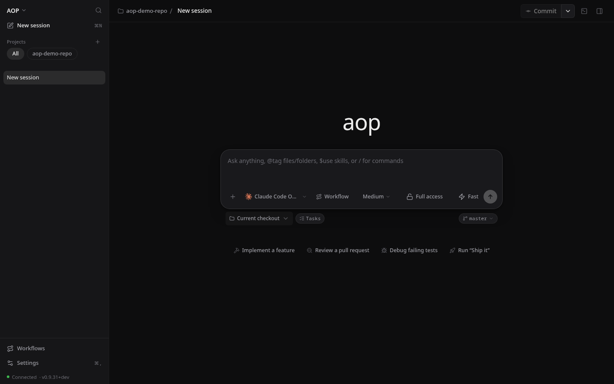

# AOP

**Agents Operating Platform** is a local-first orchestrator for coding-agent CLIs. Everything runs on your machine: no hosted orchestrator, no AOP account, no analytics. The only outbound request is an update check against `getaop.com`, which you can disable — just one control plane for the CLIs you already use.

AOP gives you interactive Sessions, reusable workflows, isolated git worktrees, live logs, and PR/CI handoff from a local dashboard. It is MIT-licensed alpha software; expect rapid iteration and occasional breaking changes.



## Install

### macOS or Linux

Install the CLI, local server, and dashboard:

```bash
curl -fsSL https://getaop.com/install.sh | sh
```

### macOS desktop

- [Apple silicon DMG](https://getaop.com/latest/aop-macos-arm64.dmg)
- [Intel DMG](https://getaop.com/latest/aop-macos-x64.dmg)

`AOP.app` checks Git, GitHub CLI, and supported runtimes before opening the dashboard. Missing-tool buttons open the official installation guides in your browser; AOP does not install those tools for you.

### From source

```bash
git clone https://github.com/get-aop/aop-mono.git
cd aop-mono
./install
```

The installer builds AOP, links the `aop` CLI, registers the background user service, and opens the dashboard at `http://aop.localhost:25150`.

## Five-minute quick start

1. Open **Settings → Repositories** and register a repository.
2. Open **Sessions**, attach that repository, and start a session.
3. Enter `/task create <request>`. AOP generates `task.md`, `prd.md`, and `issues.md` from the request.
4. Use the task assignment card to choose a worker, then select **Assign and Start**.
5. Watch the run advance in the thread, the Tasks pane, and the terminal dock; open task detail for specs, live logs, runtime events, and usage.
6. When the workflow is done, create the PR from the session and follow its CI status from AOP.

Task creation starts in chat. The active-worker limit is 4 on the free tier.

## Product map

| Guide | What it covers |
| --- | --- |
| [Chat](./docs/CHAT.md) | Sessions, attachments, workspace binding, queueing, terminal, and live factory context |
| [Commands](./docs/COMMANDS.md) | Slash commands, composer tokens, control loans, delegation, and runtime controls |
| [Tasks](./docs/TASKS.md) | Task packages, lifecycle, assignment, specs review, runs, and handoff |
| [Workflows](./docs/WORKFLOW.md) | Steps, signals, transitions, loops, the Settings editor, and built-ins |
| [Runtimes](./docs/RUNTIMES.md) | Supported agent CLIs, Runtime configuration, auth homes, and diagnostics |
| [MCP](./docs/MCP.md) | Tools available to MCP-capable interactive runtimes |
| [CLI](./apps/cli/README.md) | Supported local HTTP-client commands and service information |
| [Architecture](./docs/architecture/README.md) | Local-first boundaries, storage, execution, desktop, and updates |
| [Licensing](./docs/licensing.md) | Free, Pro, and Team worker limits and license-key operation |
| [Product tour](./docs/demo/README.md) | Screenshot walkthroughs of sessions, workflows, tasks, and handoff |

## Supported agent CLIs

AOP orchestrates Claude Code, Codex CLI, Grok, OpenCode, and Pi. Install and authenticate at least one runtime, then select it from the session runtime chip or a workflow step. See [Runtimes](./docs/RUNTIMES.md) for capability details.

## Local architecture

The Bun and Hono local server hosts the API, orchestrator, and dashboard at `http://aop.localhost:25150`. SQLite state lives at `~/.aop/aop.sqlite`; task packages, worktrees, JSONL logs, and isolated runtime auth homes also stay under `~/.aop/`.

The server runs as a background launchd or systemd user service, so closing the browser does not stop active work. The CLI is a thin client for that local service.

## Remove a repository or uninstall

Use **Settings → Repositories** or:

```bash
aop repo:remove <path>
```

The command asks you to type the repository name. Add `--force` only when working tasks must be aborted. Removing the final repository resets AOP runtime data but preserves runtime authentication homes.

For a source installation:

```bash
./uninstall
```

The uninstaller stops the service and unlinks the CLI while leaving `~/.aop/` intact.

## Contributing

See [CONTRIBUTING.md](./CONTRIBUTING.md) and [aop/README.md](./aop/README.md). Repository-wide verification commands are documented there.

## Acknowledgements

AOP's Sessions UI presentation is derived from [T3 Code](https://github.com/pingdotgg/t3code) (MIT, © 2026 T3 Tools Inc.), its dashboard primitives are built on [shadcn/ui](https://github.com/shadcn-ui/ui) (MIT, © 2023 shadcn), and parts of its workflow methodology come from [Superpowers](https://github.com/obra/superpowers) (MIT, © 2025 Jesse Vincent). Full attribution and license texts live in [THIRD_PARTY_NOTICES.md](./THIRD_PARTY_NOTICES.md).

## License

AOP is [MIT licensed](./LICENSE).
